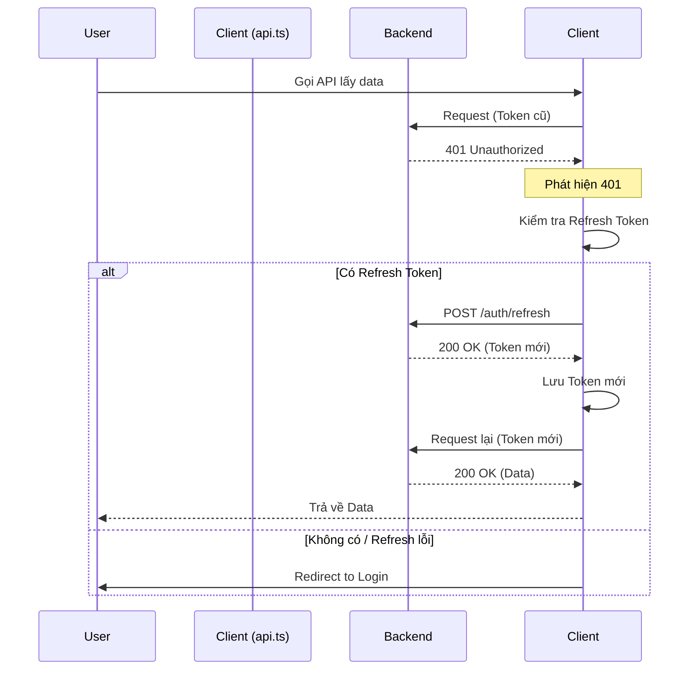

# Hướng dẫn sử dụng API & Authentication

Tài liệu này giải thích cách client (Next.js) giao tiếp với server (Spring Boot) và cơ chế xác thực (Authentication) đang được áp dụng.

## 1. Wrapper `api` là gì?

Thay vì dùng `fetch` trần của Javascript ở khắp mọi nơi, chúng ta dùng một hàm bao (wrapper) tên là `api` nằm trong `lib/api.ts`.

**Tại sao cần wrapper này?**
1.  **Tự động gắn Token**: Không cần thủ công thêm header `Authorization` mỗi lần gọi.
2.  **Tự động Refresh Token**: Khi token hết hạn (lỗi 401), nó tự động xin token mới và gọi lại request cũ mà không làm gián đoạn trải nghiệm người dùng.
3.  **Base URL chuẩn**: Tự động nối với `/api` (đã được proxy sang backend).
4.  **Xử lý lỗi chung**: Gom nhóm cách trả về lỗi.

## 2. Cách sử dụng (Fetch API)

### GET Request (Lấy dữ liệu)

```typescript
import { api } from '@/lib/api';

// Cách gọi đơn giản
const loadData = async () => {
    try {
        // Tương đương: GET http://localhost:3000/api/problems
        const data = await api('/problems');
        console.log(data);
    } catch (error) {
        console.error("Lỗi:", error);
    }
};
```

### POST Request (Gửi dữ liệu)

```typescript
import { api } from '@/lib/api';

const createProblem = async (newProblem) => {
    try {
        const result = await api('/problems', {
            method: 'POST',
            body: JSON.stringify(newProblem), // Tự động có Content-Type: application/json
        });
        return result;
    } catch (error) {
        alert(error.message);
    }
};
```

## 3. Cơ chế Authentication (Token)

Hệ thống sử dụng **JWT (JSON Web Token)** với cơ chế **Access Token** và **Refresh Token**.

### A. Lưu trữ Token
Khi đăng nhập thành công, chúng ta lưu 2 cookie:
- `accessToken`: Token ngắn hạn (ví dụ: 1 giờ). Dùng để gọi API.
- `refreshToken`: Token dài hạn (ví dụ: 7 ngày). Dùng để xin cấp lại accessToken mới.

### B. Tự động gắn Token
Trong hàm `api` (file `lib/api.ts`), trước khi gửi request đi:

```typescript
// 1. Lấy token từ Cookie
let token = Cookies.get('accessToken');

// 2. Nếu có token, gắn vào Header
if (token) {
    headers['Authorization'] = `Bearer ${token}`;
}
```

Kết quả là Backend nhận được header: `Authorization: Bearer eyJhbGci...`

## 4. Cơ chế Refresh Token (Tự động đăng nhập lại)

Đây là phần phức tạp nhất nhưng đã được xử lý tự động.

**Kịch bản:** Bạn đang dùng web thì `accessToken` hết hạn.
1.  **Client**: Gọi API `/problems`.
2.  **Backend**: Trả về lỗi `401 Unauthorized` (do token hết hạn).
3.  **Client (`lib/api.ts`)**:
    *   Phát hiện lỗi `401`.
    *   Tạm dừng request hiện tại.
    *   Lấy `refreshToken` từ cookie.
    *   Gọi API `/auth/refresh` để xin token mới.
4.  **Nếu Refresh thành công**:
    *   Lưu `accessToken` mới vào cookie.
    *   Tự động gọi lại request `/problems` ban đầu với token mới.
    *   Trả về dữ liệu cho người dùng như chưa có gì xảy ra.
5.  **Nếu Refresh thất bại** (Refresh token cũng hết hạn hoặc không hợp lệ):
    *   Xóa sạch cookie.
    *   Chuyển hướng về trang `/login`.

### Sơ đồ luồng xử lý 401:


